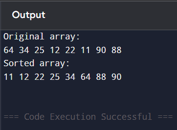
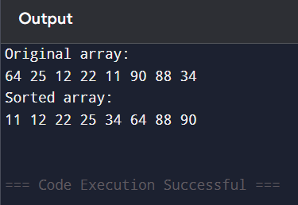
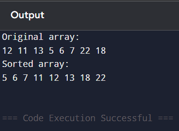
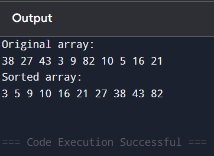
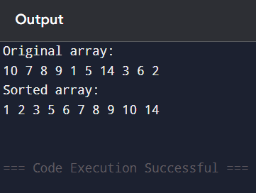
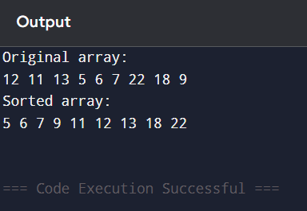
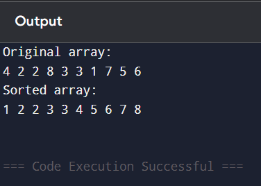
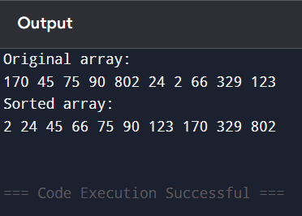
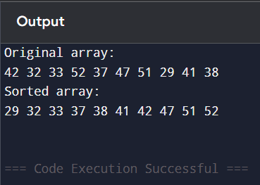
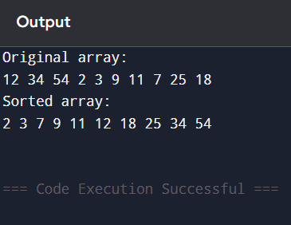

# Top 10 Sorting Algorithms in C++

A comprehensive collection of the most important sorting algorithms implemented in C++. This repository demonstrates algorithmic expertise and serves as both a portfolio piece and an educational resource.

## 📚 Algorithms Included

1. **Bubble Sort** - Simple comparison-based algorithm
2. **Selection Sort** - In-place comparison sorting
3. **Insertion Sort** - Efficient for small datasets
4. **Merge Sort** - Divide-and-conquer algorithm
5. **Quick Sort** - Efficient partitioning-based sort
6. **Heap Sort** - Heap data structure-based sorting
7. **Counting Sort** - Non-comparison integer sorting
8. **Radix Sort** - Digit-by-digit sorting
9. **Bucket Sort** - Distribution-based sorting
10. **Shell Sort** - Generalized insertion sort

## ⚡ Complexity Analysis

| Algorithm | Best Case | Average Case | Worst Case | Space Complexity | Stable |
|-----------|-----------|--------------|------------|------------------|--------|
| Bubble Sort | O(n) | O(n²) | O(n²) | O(1) | Yes |
| Selection Sort | O(n²) | O(n²) | O(n²) | O(1) | No |
| Insertion Sort | O(n) | O(n²) | O(n²) | O(1) | Yes |
| Merge Sort | O(n log n) | O(n log n) | O(n log n) | O(n) | Yes |
| Quick Sort | O(n log n) | O(n log n) | O(n²) | O(log n) | No |
| Heap Sort | O(n log n) | O(n log n) | O(n log n) | O(1) | No |
| Counting Sort | O(n + k) | O(n + k) | O(n + k) | O(k) | Yes |
| Radix Sort | O(nk) | O(nk) | O(nk) | O(n + k) | Yes |
| Bucket Sort | O(n + k) | O(n + k) | O(n²) | O(n) | Yes |
| Shell Sort | O(n log n) | O(n^(4/3)) | O(n^(3/2)) | O(1) | No |

*Note: k represents the range of input values*

## 🚀 Usage

Each algorithm is contained in its own `.cpp` file and can be compiled and run independently.

### Compilation

**Linux/Mac:**
```bash
g++ bubbleSort.cpp -o bubbleSort
./bubbleSort

**Windows (PowerShell):**
```powershell
g++ bubbleSort.cpp -o bubbleSort.exe
.\bubbleSort.exe
```

### Troubleshooting Windows Compilation

If g++ doesn't create .exe files:

1. **Check if g++ is installed**: Run `g++ --version`
2. **Install MinGW-w64 or MSYS2** if not installed
3. **Add to PATH**: Add MinGW/MSYS2 bin folder to System PATH
4. **Restart terminal/VS Code** after changing PATH
5. **Check Windows Defender**: Antivirus may block .exe creation
   - Add your project folder to Windows Defender exclusions

### Alternative: Online Compilers (No Installation Required)

If you're having compilation issues, use these online compilers:

- **OnlineGDB**: https://www.onlinegdb.com/online_c++_compiler
- **Compiler Explorer**: https://godbolt.org/
- **Replit**: https://replit.com/languages/cpp

Simply copy-paste any .cpp file and run it online!

### Example for all algorithms

```bash
# Compile
g++ algorithm_name.cpp -o algorithm_name

# Run (Linux/Mac)
./algorithm_name

# Run (Windows)
algorithm_name.exe
```

## 💼 Business Goals & Applications

Understanding sorting algorithms is fundamental to software engineering and has direct business applications:

### 1. **Database Optimization**
   - **Goal**: Improve query performance and data retrieval speed
   - **Application**: Choosing the right sorting algorithm for indexing and ordering database records
   - **Value**: Faster response times, better user experience, reduced infrastructure costs

### 2. **E-Commerce & Product Ranking**
   - **Goal**: Sort products by price, rating, popularity in real-time
   - **Application**: Quick Sort and Merge Sort for large product catalogs
   - **Value**: Enhanced customer experience, increased conversion rates

### 3. **Financial Systems**
   - **Goal**: Process and order large volumes of transactions efficiently
   - **Application**: Heap Sort for priority queues in trading systems; Counting Sort for transaction IDs
   - **Value**: High-frequency trading capabilities, regulatory compliance, audit trails

### 4. **Data Analytics & Reporting**
   - **Goal**: Prepare and aggregate data for business intelligence
   - **Application**: Merge Sort for stable sorting in data pipelines
   - **Value**: Accurate reports, data-driven decision making

### 5. **Search Engine Optimization**
   - **Goal**: Rank search results by relevance
   - **Application**: Quick Sort variants for ranking algorithms
   - **Value**: Better search quality, user satisfaction

### 6. **Resource Scheduling**
   - **Goal**: Allocate CPU, memory, or network resources efficiently
   - **Application**: Heap Sort for priority-based task scheduling
   - **Value**: System efficiency, reduced latency, fair resource distribution

### 7. **Educational Technology**
   - **Goal**: Demonstrate algorithmic thinking and complexity analysis
   - **Application**: All algorithms serve as teaching tools
   - **Value**: Skill development, interview preparation, computer science education

### 8. **Algorithm Selection Expertise**
   - **Goal**: Choose the optimal algorithm based on data characteristics
   - **Application**: 
     - Small datasets → Insertion Sort
     - Nearly sorted data → Insertion/Bubble Sort
     - Large datasets → Quick/Merge Sort
     - Limited memory → Heap Sort
     - Integer ranges → Counting/Radix Sort
   - **Value**: Performance optimization, resource efficiency

## 📖 Algorithm Descriptions

### Comparison-Based Sorts

**Bubble Sort** (`bubbleSort.cpp`)
- Repeatedly swaps adjacent elements if they're in wrong order
- Simple but inefficient for large datasets
- Good for: Teaching, nearly sorted data

**Selection Sort** (`selectionSort.cpp`)
- Finds minimum element and places it at the beginning
- In-place but not stable
- Good for: Small datasets, minimal memory

**Insertion Sort** (`insertionSort.cpp`)
- Builds sorted array one element at a time
- Efficient for small or nearly sorted data
- Good for: Small datasets, online sorting

**Merge Sort** (`mergeSort.cpp`)
- Divides array, sorts halves, then merges
- Guaranteed O(n log n), stable
- Good for: Large datasets, linked lists, external sorting

**Quick Sort** (`quickSort.cpp`)
- Picks pivot, partitions around it, recursively sorts
- Fast average case, widely used
- Good for: Large datasets, in-memory sorting

**Heap Sort** (`heapSort.cpp`)
- Uses binary heap data structure
- Guaranteed O(n log n), in-place
- Good for: Memory-constrained systems

### Non-Comparison Sorts

**Counting Sort** (`countingSort.cpp`)
- Counts occurrences of each value
- Linear time for limited range of integers
- Good for: Integer sorting with small range

**Radix Sort** (`radixSort.cpp`)
- Sorts digits from least to most significant
- Linear time for fixed-length keys
- Good for: Strings, fixed-length integers

**Bucket Sort** (`bucketSort.cpp`)
- Distributes elements into buckets, sorts each
- Average linear time for uniform distribution
- Good for: Floating-point numbers, uniform data

**Shell Sort** (`shellSort.cpp`)
- Generalization of insertion sort with gap sequence
- Better than O(n²) with right gap sequence
- Good for: Medium-sized datasets, embedded systems

## 🛠️ Implementation Details

All implementations include:
- ✅ Clear, commented code
- ✅ Example test cases in `main()`
- ✅ Display functions to visualize output
- ✅ Standard C++ (no external dependencies)

## 📝 Files Structure

```
sorting-algorithms-top-10/
├── README.md              # This file
├── bubbleSort.cpp         # Bubble Sort implementation
├── selectionSort.cpp      # Selection Sort implementation
├── insertionSort.cpp      # Insertion Sort implementation
├── mergeSort.cpp          # Merge Sort implementation
├── quickSort.cpp          # Quick Sort implementation
├── heapSort.cpp           # Heap Sort implementation
├── countingSort.cpp       # Counting Sort implementation
├── radixSort.cpp          # Radix Sort implementation
├── bucketSort.cpp         # Bucket Sort implementation
└── shellSort.cpp          # Shell Sort implementation
└── screenshots            # Screenshots of results
```

## Screenshots

### Bubble Sort


### Selection Sort


### Insertion Sort


### Merge Sort


### Quick Sort


### Heap Sort


### Counting Sort


### Radix Sort


### Bucket Sort


### Shell Sort


## 🎯 Learning Outcomes

By studying these implementations, you will understand:
- Time and space complexity trade-offs
- When to use comparison vs. non-comparison sorts
- Stability and its importance in sorting
- Divide-and-conquer strategies
- In-place vs. out-of-place algorithms
- Practical algorithm selection criteria

## 🤝 Contributing

This repository is maintained as a portfolio piece. If you find any issues or improvements, feel free to suggest them.

## 📄 License

Free to use for educational purposes.

---

**Author**: Muzammil  
**Purpose**: Algorithm expertise demonstration & educational resource
